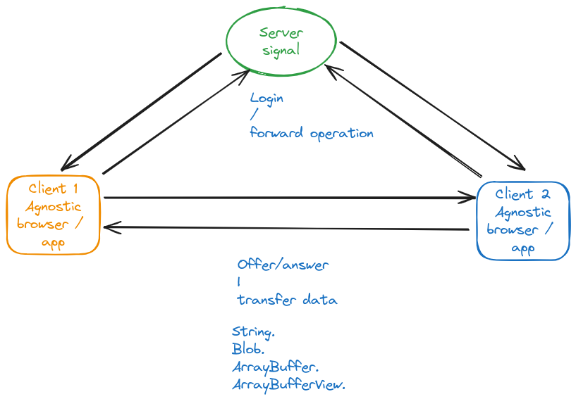

## Signal-Server NodeJS

## Summary

Permit connect browser|vm|pc|iot|etc with support websocket.

- [x] Add support pm2.
- [x] Add support docker.
- [x] Add support websocket server WS, and client: Browser, Python and JS.
- [x] Add support logging.



## Using

```

mkdir log

development.env

PORT=8080

npm run dev

```
